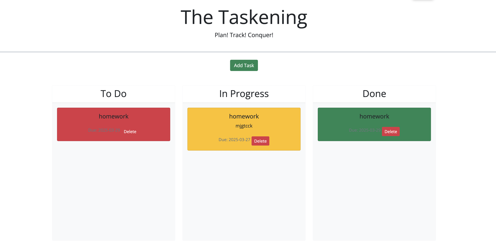
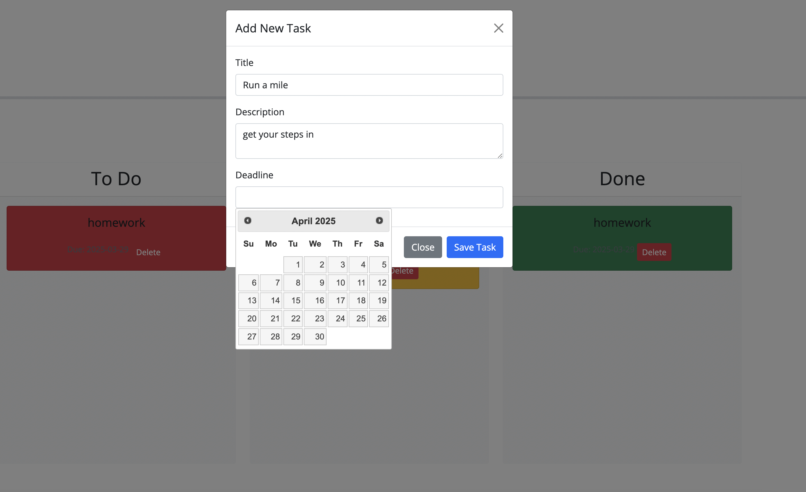

# Task-Board

## Link
https://llilianmena.github.io/The-Taskening/

# Task Board Application

## Overview
This project is a simple task board designed to help manage tasks in a project. It visually tracks tasks across different progress states and provides easy interaction features like adding, updating, and deleting tasks.

## Features
- Display tasks in columns representing their progress state: **Not Yet Started**, **In Progress**, and **Completed**.
- Color-coded tasks to indicate deadlines:
  - **Yellow**: Task is nearing the deadline.
  - **Red**: Task is overdue.
- Create new tasks with a **title**, **description**, and **deadline** via a modal form.
- Save tasks to **localStorage** to ensure persistence across page refreshes.
- Drag-and-drop functionality to update the progress state of tasks.
- Delete tasks permanently from the board.

## Acceptance Criteria

### 1. Task Board Display
- **GIVEN** a task board to manage a project
- **WHEN** I open the task board
- **THEN** the list of project tasks is displayed in columns representing the task progress state (**Not Yet Started**, **In Progress**, **Completed**)

### 2. Task Color Coding
- **WHEN** I view the task board for the project
- **THEN** each task is color-coded to indicate whether it is:
  - **Yellow** if nearing the deadline
  - **Red** if overdue

### 3. Adding a New Task
- **WHEN** I click on the button to define a new task
- **THEN** I can enter the **title**, **description**, and **deadline date** for the new task into a **modal dialog**
- **WHEN** I click the **save** button for that task
- **THEN** the task is saved to **localStorage**

### 4. Drag and Drop Tasks
- **WHEN** I drag a task to a different progress column
- **THEN** the task's **progress state** is updated accordingly
- **AND** the task remains in the new column after **refreshing** the page

### 5. Delete Task
- **WHEN** I click the **delete** button for a task
- **THEN** the task is removed from the task board
- **AND** will **not** reappear after **refreshing** the page

### 6. Persistence
- **WHEN** I refresh the page
- **THEN** the saved tasks persist, showing the correct progress state, color, and details

## Setup Instructions
1. Clone this repository.
2. Open `index.html` in your browser.
3. Begin managing your tasks on the board!

## Future Enhancements
- User authentication for personalized task boards.
- Additional columns for **Blocked** or **On Hold** tasks.
- Task editing feature.
- Calendar view integration.